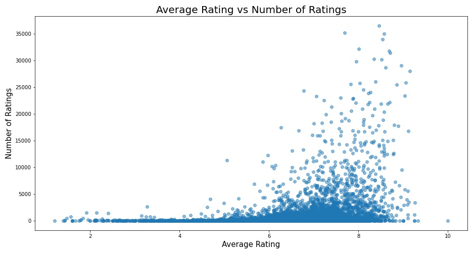
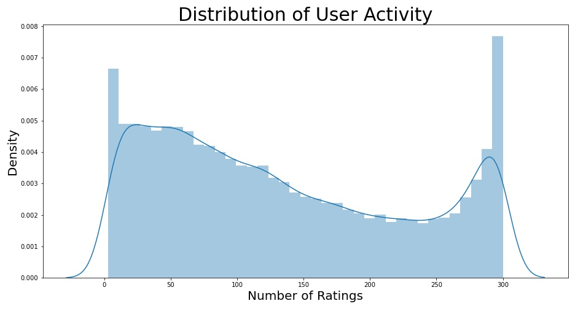

# Unofficial MyAnimeList Anime Recommendation system
by Andre Yu Tiamco

# Introducing the Data
The data for this project was web scraped by myself over the course of ~5 days from August 1st to August 6th of 2021. The pages scraped have urls of the form `https://www.myanimelist.net/animelist/{USERNAME}`. [Here](myanimelist.net/animelist/figgyboyo) is an example. The resulting utility matrix (after removing some entries due shows or users having too few ratings) contains ratings from 55,992 users for 10,254 shows/movies on MyAnimeList. There are 7,400,757 ratings in total, resulting in a matrix that is 98.7% sparse.

## Exploratory Data Analysis

The above is the distribution of the average rating for each show in the dataset. As is clear. the average overall sits at around 6.5 out of 10.

This is a graph of the average rating for each show (x axis) against the number of ratings for that show present in the dataset (y axis). As is clear, the more popular shows tend to be rated more highly. Additionally, the vast majority of shows in the dataset have very few ratings. A few shows can appear to be better than they actually are as a result (due to having very few ratings that happen to be very high).

The above shows the distribution of how many shows each user has rated. As is clear, the distribution is very even. There are many users with almost no ratings, but even more users who have rated nearly 300 shows.

# The Modelling Process
## Initial Model
The first instinct upon finishing scraping the data was to create a simple SVD. This initial model used 100 factors with an epoch of 100. The resulting predictions had an RMSE of 1.29, and a graph of Predictions vs Actual ratings can be seen below.

This model has approximately equivalent overestimates and underestimates, but with a very wide spread for some of the predictions. With an RMSE of 1.29, its performance appears to be decent on the surface. However, the model takes all of 20+ minutes to fit. This is simply unusable as a result. Each time that one might want to generate predictions for a new user, they would have to refit the SVD, spending another 20 minutes to generate each list of predictions. The impracticality outweighs the relatively good performance of the model.

## Memory-based Attempts
After finding that SVD took too much time to be practical, I then tried to fit a memory-based KNNBasic model. This model would have used cosine similarity. I say "would have used" because the model was simply too large to be run in Jupyter Lab.

This was a rather major road block to developing the model. After some consideration, I chose to continue using a memory-based model, but instead of creating a full similarity matrix, I would instead code the memory-based K neighbors model from scratch.

### Memory-based from Scratch
#### First Version
To create these models, I made a function that takes a username and the dataset as inputs. Using the username, the funciton scrape data from MAL. This data is then used to compare the given user to all 55,000+ users in the dataset using simple cosing similarity. Then, a new dataset is created, containing only the users in the dataset to which the given user is most similar (specifically, the top 2.5% of cosine similarities). This dataset is further filtered to contain only shows that the user has not yet rated on MAL. Then, the missing values for each user in the dataset are imputed using the mean ratings for each user. Finally, predicted ratings for each show are computed using a weighted average.

As a result of this process manually computing predictions one user at a time, the testing set for this model was necessarily small (1000 test points). Creating these predictions took some 5 hours, and the results (in the form of a graph of predictions vs actual ratings) are below.

[Memory-Based](Images/Initial_Model_PredvAct.jpeg)

This model had an RMSE of 1.63. While this is worse than the SVD, the model runs much faster. To be precise, it takes less than 30 seconds to generate predictions for a given user.

However, this model clearly overestimates some of the worse-rated shows. This happened as a result of imputation using the mean. Due to the tendency to simply predict the most average rating, there is little discernability between different shows based purely on the predictions.

#### The Gauntlet of Failed Models
The following is a quick look at all the intermediary models that were deemed too imprecise. The code for each of these models is not included in the notebook for this repository due to logistical reasons, but an explanation of each is provided here. Note that most of these models have an RMSE of 3 or greater, meaning that they are far less accurate than the above model.

[1](Images/Initial_Model_PredvAct_2.jpeg)

This model takes the first model and imputes missing values with 0 instead of the mean. As a result, it tends to vastly underestimate most shows. Also, it occasionally predicts a 0, which is impossible, as the MAL rating system only goes from 1 to 10.

[2](Images/Initial_Model_PredvAct_3.jpeg)

This model instead imputes using 1. Additionally, it uses far fewer neighbors to avoid underfitting (using the top 0.1% of cosine similarities instead of the top 2.5%). While it no longer gives impossible preditions, it still underestimates shows.

[3](Images/Initial_Model_PredvAct_4.jpeg)

This model takes the previous model and imputes using 5. While there are fewer underestimations, there are now too many overestimations.

[4](Images/Initial_Model_PredvAct_5.jpeg)

This model imputes using 3. It is not much of an improvement over the previous one.

#### The Final Model
After much experimentation, the following model was created.

[5](Images/Final_Model_PredvAct.jpeg)

This model uses cosine similarity to find the top 0.1% of similar users to the given user. It then filters the dataset as previously explained and imputes missing values with 3. The key difference between this model and the last model from the Gauntlet seen above is that the predictions from this model are then fed through a linear regression. This linear regression uses a show's predicted rating from the KNN memory-based model, the average rating for the show in the database, and the number of ratings for the show in the database to create its predictions. The result is seen above.

Due to some optimizations, the model is capable of generating predictions in less than 20 seconds, allowing for a larger test set of 1,600 points. Additionally, the model has an RMSE of 1.47, which is a sizable improvement over the original memory-based model.

Overall, this model works significantly faster than the SVD whilst also generating comparably accurate predictions.